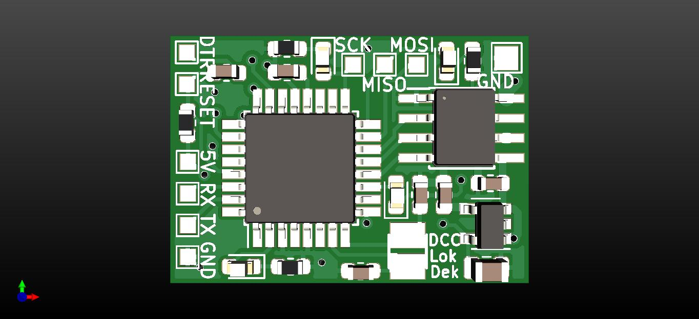
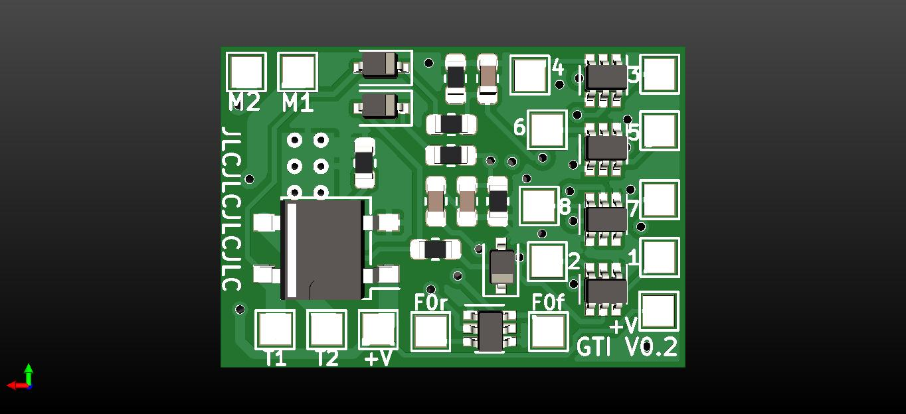

# DCC-Lokdecoder
## Description
DCC multifunction decoder for H0 locomotives
## Features
- 1 motor H-bridge output
  - 3.6 A peak current
  - PWM frequency configurable (1-40 kHz)
  - overcurrent and temperature protected
- 10 function outputs
  - 115 mA per output
  - F0f, F0r, AUX1 and AUX2 are dimmable *todo*
  - mappable to F0-F12 function keys
- DCC asymmetry can be detected (for automatic brake control) *todo*
## Hardware
- 4-layer PCB esigned in KiCAD
- fairly standard components (available from Digi-Key, Farnell, Mouser, etc...)
- hand solderable (I did it too)
- 4 debug LEDs (red, yellow, green and blue)

|  |  |
| :---: | :---: |
| top side | bottom side |

## Firmware
- Arduino compatible programming (behaves like an UNO)
- DCC decoding by [NmraDcc](https://github.com/mrrwa/NmraDcc) library

## JMRI integration

|  |  |  |  |  |  |
| :---: | :---: | :---: | :---: | :---: | :---: |
| Basic  | Motor | Basic speed control | Speed table | Function map | Advanced |

## Install guide

reset to factory

## Todo list
- [ ] CV15, CV16 decoder locking
- [ ] CV65 kick start
- [ ] CV67-94 speed table
- [ ] CV27 automatic brake control
- [ ] function output dimming
- [ ] motor fault check
