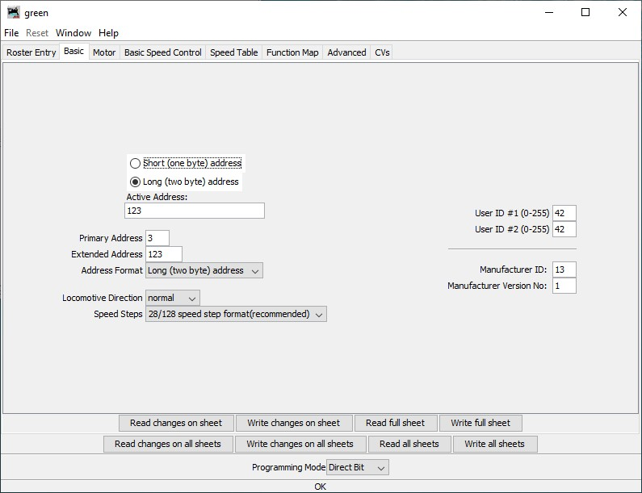
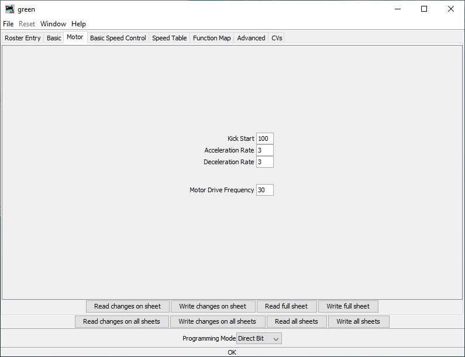
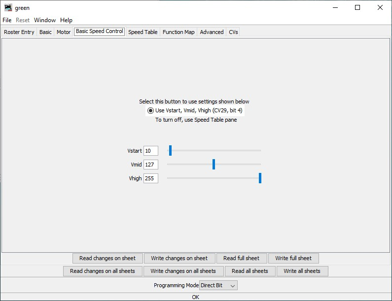
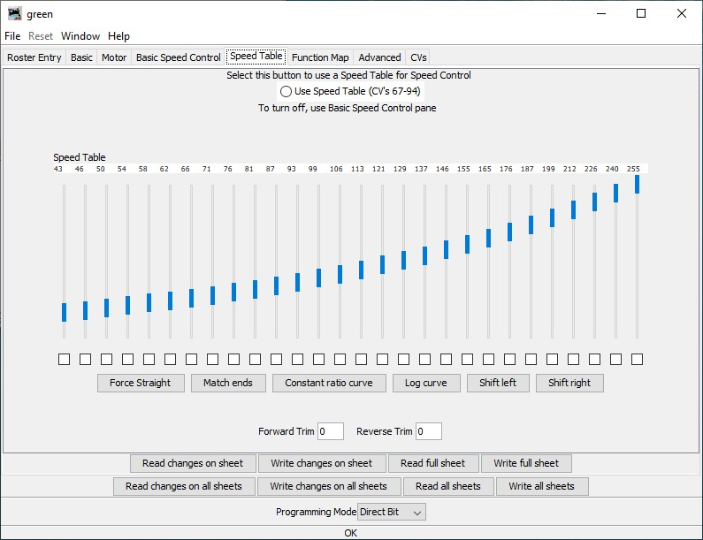
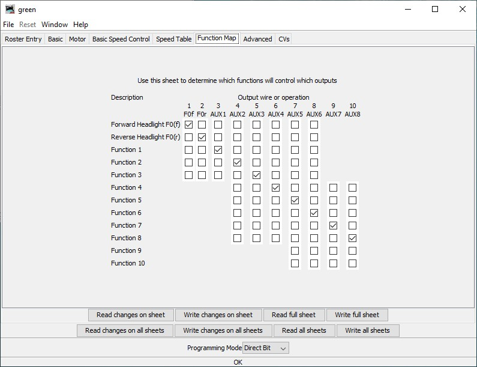
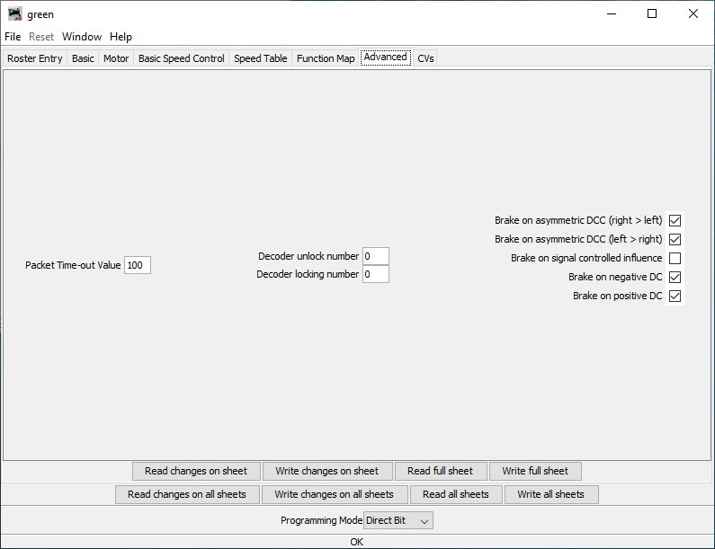
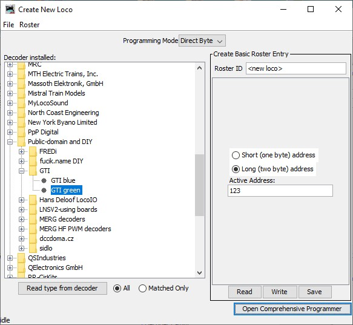

# DCC-Lokdecoder
## Description
DCC multifunction decoder for H0 locomotives
## Features
- 1 motor H-bridge output
  - 3.6 A peak current
  - PWM frequency configurable (1-40 kHz)
  - overcurrent and temperature protected
- 10 function outputs
  - 115 mA per output
  - F0f, F0r, AUX1 and AUX2 are dimmable *todo*
  - mappable to F0-F12 function keys
- DCC asymmetry can be detected (for automatic brake control) *todo*
## Hardware
- 4-layer PCB esigned in KiCAD
- fairly standard components (available from Digi-Key, Farnell, Mouser, etc...)
- hand solderable (I did it too)
- 4 debug LEDs (red, yellow, green and blue)

|  |  |
| :---: | :---: |
| top side | bottom side |

## Firmware
- Arduino compatible programming (behaves like an UNO)
- DCC decoding by [NmraDcc](https://github.com/mrrwa/NmraDcc) library

## JMRI integration

|  |  |  |  |  |  |
| :---: | :---: | :---: | :---: | :---: | :---: |
| Basic  | Motor | Basic speed control | Speed table | Function map | Advanced |

## Install guide

1. Get the PCB (e.g. [JLCPCB](https://jlcpcb.com/)) and the components (e.g. [mouser](https://www.mouser.at/), [digikey](https://www.digikey.at/))
2. Solder the components. The SOIC with exposed pad is a bit tricky, it can be soldered from the other side with a big tip and a lot of flux.
3. Install the Arduino bootloader using the pads 5V, GND, SCK, MISO, MOSI, RST and an Arduino. [Arduino as ISP](https://www.arduino.cc/en/Tutorial/BuiltInExamples/ArduinoISP)
4. Uncomment the line `#define RESET_FACTORY_DEFAULTS` to fill the EEPROM with the default CV values
5. Upload the code using the pads 5V, GND, RX, TX, DTR and a USB TTL UART cable [like this](https://www.mouser.at/ProductDetail/FTDI/TTL-232R-5V-WE/?qs=OMDV80DKjRpCUAS6UR9QpQ%3D%3D)
6. Re-comment the line `#define RESET_FACTORY_DEFAULTS` to avoid resetting to factory defaults every time.
7. Upload the code again.
8. Add the decoder XML file to JMRI. In DecoderPro select "File-> Import Decoder File..." and browse to the decoder [XML](JMRI_decoder_file/Public_Domain_GTI_green.xml). It will take some time, then adds the decoder definition to the database.
9. Connect the T1 and T2 pads to the programming track of your DCC system.
10. Add new locomotive with the "New Loco" button and then "Read type from decoder". It should detect the correct type:

11. If everything is fine, you can install the decoder into your locomotive!
### Pinout
| Pad | Function |
| :-- | :-- |
| M1 | Motor 1 |
| M2 | Motor 2 |
| T1 | Track 1 |
| T2 | Track 2 |
| V+ | Positive common for function outputs (keep-alive capacitor positive) |
| F0f | F0 function output forward (open drain) |
| F0r | F0 function output reverse (open drain) |
| AUXn | AUX function output n (open drain) |
| 5V | internal microcontroller +5V supply |
| GND | ground (keep alive capacitor negative) |
| SCK | ISP programming clock (connect to ISP SCK) |
| MISO | ISP programming read (connect to ISP MISO) |
| MOSI | ISP programming write (connect to ISP MOSI) |
| RST | ISP programming reset (connect to ISP reset output)
| RX | serial programming receive (connect to TTL UART TX) |
| TX | serial programming transmit (connect to TTL UART RX) |
| DTR | serial programming reset through a 100 nF capacitor (connect to TTL UART DTR) |

## Todo list
- [ ] CV15, CV16 decoder locking
- [ ] CV65 kick start
- [ ] CV67-94 speed table
- [ ] CV27 automatic brake control
- [ ] function output dimming
- [ ] motor fault check
